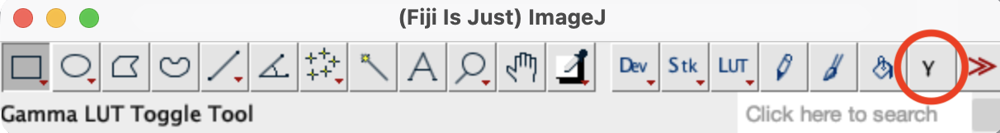

# Gamma_LUT_Toggle
Makes a button in the Fiji toolbar with a greek gamma symbol. When you click the button, it will apply a nondestructive gamma of 0.45 by remapping the LUT while maintaining the underlying pixel values. Clicking the button a second time will toggle the image back to the original linear LUT. Works with grayscale as well as single-color LUTs.

Figure 1. The Gamma_LUT_Toggle tool in Fiji nondestructively toggles between a LUT with gamma of 0.45 and 1.

Figure 2. Left is gamma = 1 and right is after gamma correction of gamma = 0.45. Gamma correction compensates for the computer monitor’s inherent gamma. The effect is that dim objects are no longer lost in the background and bright objects are not as saturated.

